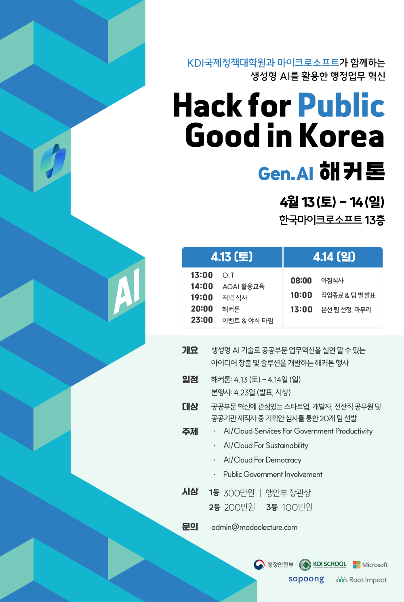
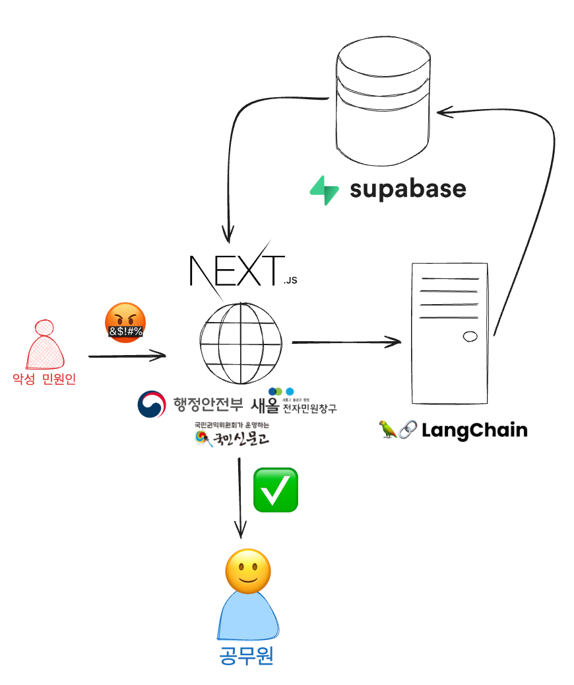

    
  

 

    
    
    
    
    
    
    
    
    
    
    

 

## 해커톤 개요

    

    
  

 

`공공부문의 효율성을 증진 혹은 업무 혁신을 실현할 수 있는 아이디어 개발`을 목표로 하여 참가자들은 주어진 데이터와 도구를 사용하여 20시간 동안 아이디어를 구현하게 됩니다.
> The goal is to develop ideas that enhance efficiency or enable innovative practices in the public sector. Participants will use the provided data and tools to implement their ideas over a period of 20 hours.

 

## `악성민원 수호자` 프로젝트 설명

`악성민원 수호자` 프로젝트는 공무원들이 온라인 상에서 겪는 `악성 민원`으로 인한 `감정노동` 문제를 해결하기 위해 `AI` 기반 서비스를 개발하였습니다. 이 서비스는 `Langchain 프레임워크`를 활용한 `LLM` 기술을 활용하여, 온라인에서 발생하는 악성 민원을 자동으로 감지하고 필터링하여 공무원의 업무 부담을 줄이고자 합니다. 이 서비스는 기존의 수동적인 방식 대신, 기존 시스템에 쉽게 통합할 수 있는 간편하고 효율적인 도구로 설계되었습니다.

주요 기능:

- `자동 감지 및 필터링`: `AI`가 온라인 악성 민원을 자동으로 감지하여 필터링합니다.
- `간편한 통합`: 기존 시스템에 쉽게 통합할 수 있도록 설계되었습니다.
- `비속어 순화`: 민원 내용 중 비속어를 순화하여 더욱 쾌적한 업무 환경을 조성합니다.

 

> `Malicious Complaint Guardian` project has developed an `AI`-based service to address the `emotional labor` issues that public officials face from `malicious complaints` online. This service utilizes the `Langchain framework` and `LLM` technology to automatically detect and filter malicious online complaints, aiming to reduce the workload of public officials. It is designed as a convenient and efficient tool that can be easily integrated into existing systems, replacing traditional manual processes.

>Key Features:

> - `Automatic Detection and Filtering`: `AI` automatically detects and filters online malicious complaints.
> - `Easy Integration`: Designed for easy integration into existing systems.
> - `Profanity Moderation`: Moderates profanity in complaints to create a more pleasant working environment.

 

|데모 영상 ( Demostration Video )|
|:-:|
||
|[발표자료 ( PDF )](public/악성민원%20멈춰.pdf)|

 

## 프로젝트 구조 ( Project Architecture )

    
  

 

## 아쉬웠던 점 ( Limitations )

- 한국어 비속어 데이터가 매우 부족해서 학습을 충분히 못하였다.
- KISO에서 출시한 [`KSS`](https://www.kiso.or.kr/kiso-%ec%86%8c%ec%8b%9d/%eb%b3%b4%eb%8f%84%ec%9e%90%eb%a3%8c/?mod=document&uid=1393) API를 연동해서 정확성을 높이고 싶었지만 법인있는 기업만 허용해주어서 연동하지 못했다.
- Microsoft에서 제공했던 OPENAI 토큰이 많이 부족해서 Personal OEPNAI 토큰 사용이 불가피하였다.
- 시간이 부족해서 최적화 진행을 많이 못했다.

> - The lack of sufficient Korean profanity data hindered thorough training.
> - We wanted to enhance accuracy by integrating the [`KSS`](https://www.kiso.or.kr/kiso-%ec%86%8c%ec%8b%9d/%eb%b3%b4%eb%8f%84%ec%9e%90%eb%a3%8c/?mod=document&uid=1393) API released by KISO, but it was only available to registered corporations, so we couldn't integrate it.
> - The OPENAI tokens provided by Microsoft were insufficient, making the use of Personal OPENAI tokens inevitable.
> - Due to time constraints, we were unable to carry out extensive optimization.

 

## 구성원 ( Members )

|                Frontend                         |                Frontend                         |                AI                         |
| :---------------------------------------------: | :---------------------------------------------: | :---------------------------------------------: |
|  |  |  |
|  [이정민](https://github.com/froggy1014)     |  [고재민](https://github.com/KoJaem)    |   [김현규](https://github.com/NerdCat822)            |

